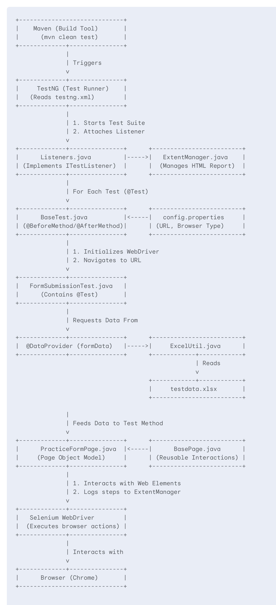
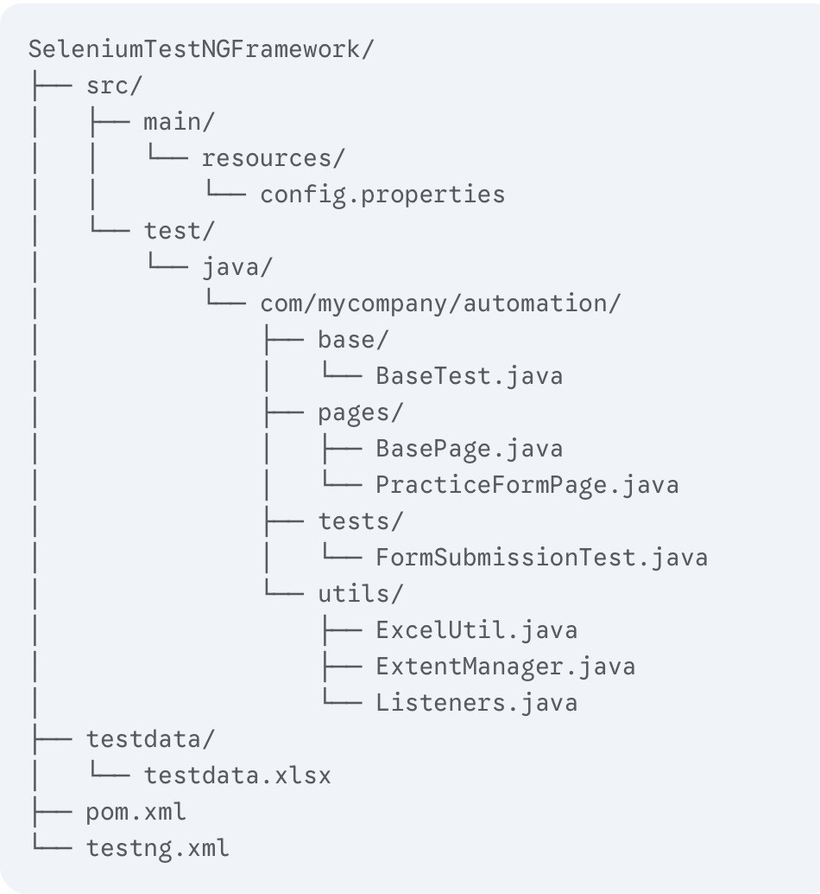

# Selenium TestNG Automation Framework

### Developed by : Suresh Manem

This is a robust, scalable test automation framework built using Java, Selenium, TestNG, and Maven. It is designed with industry best practices to provide reliable and maintainable automated tests for web applications.

## Features

* **Page Object Model (POM):** Separates UI interaction logic from test logic for better maintainability.
* **Data-Driven Testing:** Reads test data from Microsoft Excel files, allowing for easy test case expansion.
* **Configuration Management:** Manages environment details like URLs and browser types through an external `config.properties` file.
* **Detailed HTML Reporting:** Generates beautiful, detailed Extent Reports with test steps, data, and screenshots on failure.
* **Cross-Browser Support:** Easily configurable to run tests on different browsers (e.g., Chrome, Firefox, Chrome-Headless).
* **Automatic Report Opening:** The final HTML report is opened automatically in the default browser upon test suite completion.
* **Dependency Management:** Uses Maven to manage all project dependencies and build lifecycle.

---

## Architecture Overview

The framework follows a modular architecture where each component has a specific responsibility. The flow is orchestrated by TestNG and driven by data from external files. 



---

## Workflow Explanation

1.  **Execution Start:** A user or a CI/CD pipeline runs the `mvn clean test` command.
2.  **TestNG Suite:** Maven invokes the Surefire plugin, which reads `testng.xml`. TestNG then identifies the test suite and attaches the `Listeners.java` class.
3.  **Browser Setup:** For each `@Test` method, the `@BeforeMethod` in `BaseTest.java` is executed. It reads `config.properties` to determine the browser and URL, then initializes the Selenium WebDriver.
4.  **Data Provision:** The `@DataProvider` in `FormSubmissionTest.java` is invoked. It calls `ExcelUtil.java` to read all data rows from the `testdata.xlsx` file.
5.  **Test Execution:** The data provider feeds one row of data at a time to the `submitFormTest` method.
6.  **Page Interaction:** Inside the test, an instance of `PracticeFormPage.java` is created. Its methods are called to perform actions on the web page (e.g., entering text, clicking buttons).
7.  **Step Logging:** Each action performed by a page object method is logged to the Extent Report via the `ExtentManager`.
8.  **Assertions (Implicit):** The test completes its steps. (Explicit assertions should be added to verify outcomes).
9.  **Reporting:** The `Listeners` class logs the final status of the test (Pass/Fail/Skip). If a test fails, it captures a screenshot and embeds it in the report.
10. **Teardown:** The `@AfterMethod` in `BaseTest.java` quits the WebDriver session.
11. **Completion:** Once all tests are finished, the `onFinish` method in the listener flushes the report, saves it as `index.html`, and opens it automatically.

---

## How to Run

### Prerequisites

* Java Development Kit (JDK) 8 or higher
* Apache Maven

### Configuration

1.  **Set Browser and URL:** Open `src/main/resources/config.properties`.
2.  Modify the `browser` property. Supported values are `chrome`, `chrome-headless`, and `firefox`.
3.  Modify the `url` property to point to your application under test.

### Running Tests

Navigate to the project's root directory in your terminal and execute the following Maven command:

```bash
mvn clean test
```

This command will clean the project, compile the code, and run the test suite defined in `testng.xml`.

### Project Structure

